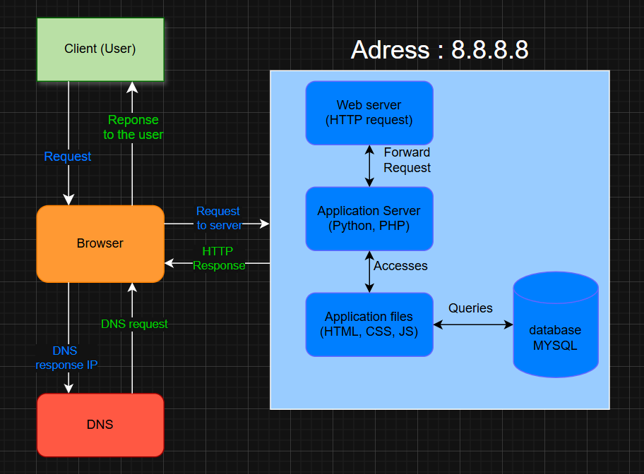

# simple web Stack

## Specification about this infrastructure:
- **the server** is a computer that provides information to other computer "clients" on a computer network, the role of the server are to share data or services to other computers wia a network

- **the role of the domain name** is to give acces to your web site with a adress ip like www.foobar.com if mapping to 8.8.8.8

- **the type of DNS record** www in www.foobar.com is **A**

- **the role of the web server** are to listenning all request from incoming web trafic, serve the static files and linked the aplication server forwzrding the dynamic request 

- **the role of the application server** are to communicate with the database with queries, to processes dynamic request (GET, POST, ...) and get responses to the web site (back-end)

- **the role of the database** is to storage your application's persistent data

- the server using **HTTP(S) protocole** to communicate with the computer of the user

## Issues with this infrastructure:
- SPOF: the wgole website is off if the server goes down

- When maintenance needed the web site will be off during the maintenance

- if too much incoming traffic, the server will could have some problem with the limit of the server performance