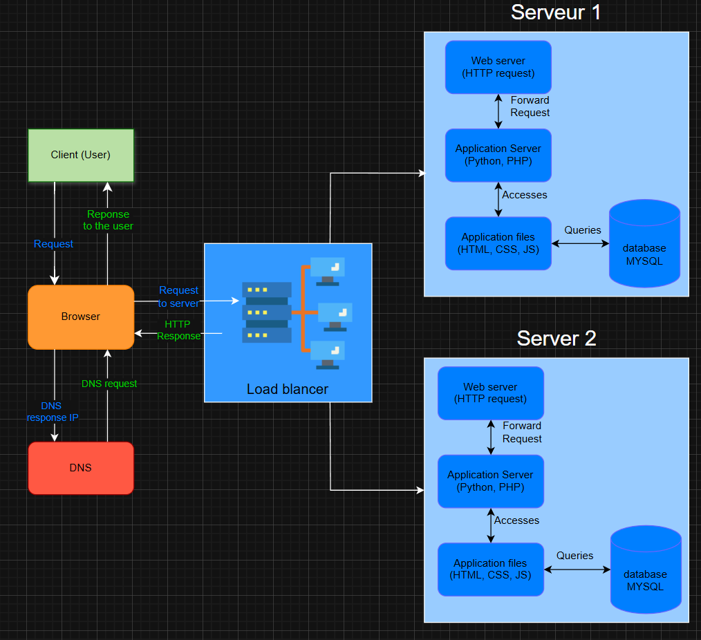

# Distributed web infrastructure

## Specification about this infrastructure:
- We add a **load-balancer** to update the distribution of all incoming trafic with several server, for improve the scalability and avability of the infrastructure web

- The **distribution algorithm** for the load balancer is configured **Round Robin**

    The algorithm distributes requests in a simple circular order to each server example:
    - request 1 --> server 1
    - request 2 --> server 2
    - request 3 --> server 1
    ...

- Load-balancer is an **Active-Active setup** because all server are active, on contrary the **Active-Passive setup** work with one server can be active and all another server are on standby

- **Database Primary-Replica (or database cluster)**: the database work with all data in the primary database (Insert, Update, Delete) and copy all data into all replica database (SELECT)

- **The difference between the Primary node and the Replica node** in regard to the application are the primary node can read and write the request on another hand the replica node can only read request

## Issues with this infrastructure:
- **SPOF**: if the load blancer down, all the infrastructure are down too

- **Security**: we haven't any firewall or HTTPS protocole

- **Monitoring**: this infrastructure haven't monitoring so no data data visibility if we have a issue