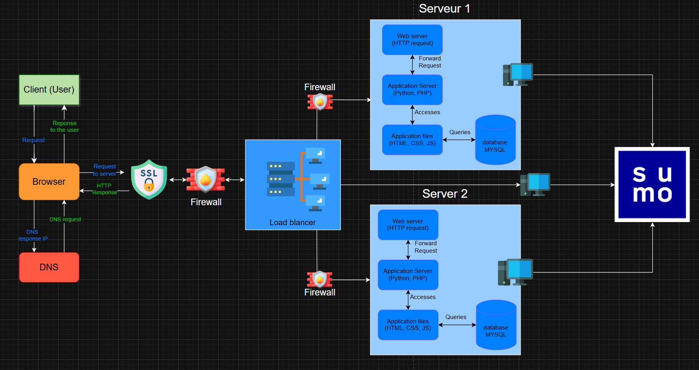

# secured and monitored web infrastructure


## Specification about this infrastructure:
- We adding:
    - Firewall for isolate composant, enforce security policies and reduce the possibility of attack surfaces 
    - SSl for secure the communication beewteen client and the infrastructure
    - Monitoring client

- **Firewalls**: it is a **network security device** can limit, allow or block the network trafic based on this configuration rules in the hardware or software, analyse every data packets that request entry to the network and is a division beewteen a private network and an outer network

- **The traffic served over HTTPS** is for to authentificate the client to the server, to have a data intergrity (can't be modified or corruped) and have a encrypted data

- **Monitoring** is used for data collection and data storage from the load-balance and servers, can be use for alerting if we have anomalies or if we detect failure and have view of the infrastructure for performence optimisation and debugging

- **The monitoring tool** is collecting data with agents,API's , exporter or log fowarding, example: the Sumo logic watch logs, parses them and send all data to the platform for realatime alert and analysis

- **Monitor the web server QPS**:
The QPS (Queries Per Second) can be mesured 2 parameter:
- Select the time frame (period we want for measure the request)
- The number of request we want during the time frame
Calculate the QPS :
```1000 request / 60 second = 10 QPS``` 

## Issues with this infrastructure:
- Why terminating SSL at the load balancer level is an issue ?
A unencrypeted traffic between the load blancer and the web servers is a litle risk in secure internal network but it's acceptable, even so it is not recommanded in a shared environement

- Why having only one MySQL server capable of accepting writes is an issue?
If the primary server MySQl fails, we don't have a new data written on the database but the application can still read data, even so any fail to write data could be a problem 

- Why having servers with all the same components (database, web server and application server) might be a problem?
if the server is hosting all components and fails, the entire application will be down too