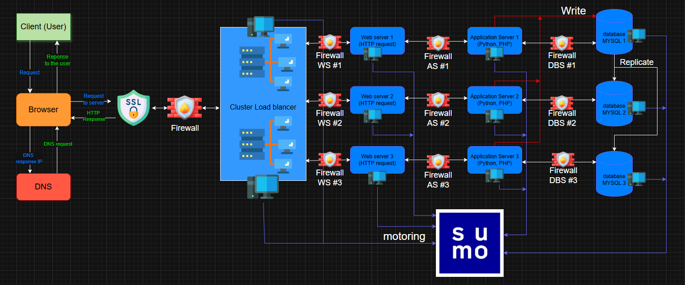

# Scale up 

## Specification about this infrastructure:
- Add a another load-balancer in a cluster ensures high availability by eliminitating the single point of failure (load-balancer), and have less fail bewteen nodes. It can improve the reliability

- We split the server for improves the performance, the security and the scalability of the infrastructure, allow each service to use resources efficienly and operate independently

- Add one more server to increases the fault tolerance and ensuiring the system remains operational even if one server fails
